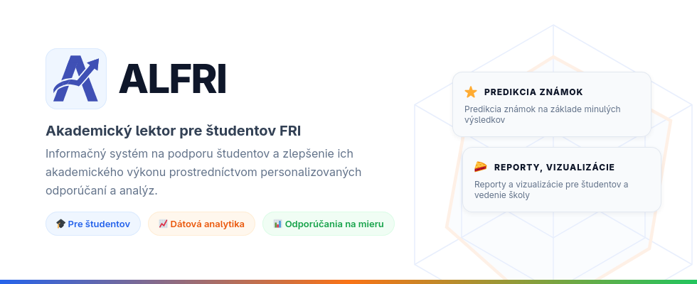
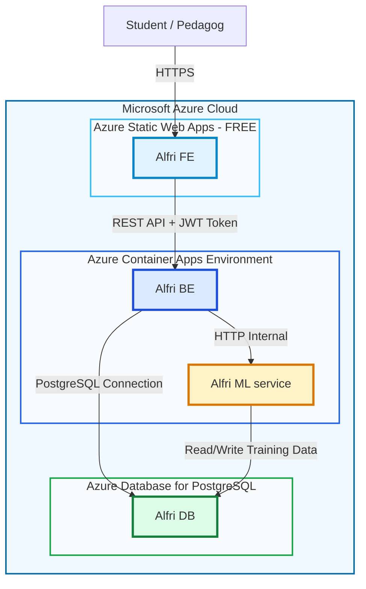

---

## 📋 Obsah

- [O projekte](#-o-projekte)
- [Tech Stack](#-tech-stack)
- [Architektúra systému](#-architektúra-systému)
- [CI/CD Pipeline](#-cicd-pipeline)

---

## 🎯 O projekte

**ALFRI** (Academic Lektor for FRI) je komplexný informačný systém navrhnutý pre študentov Fakulty riadenia a informatiky Žilinskej univerzity. Systém poskytuje:

- 📊 **Dátovú analytiku** - Analýza študijných výsledkov a výkonnosti
- 🤖 **ML-poháňané odporúčania** - Predikcia známok a odporúčanie predmetov na základe machine learning modelov
- 📈 **Vizualizácie a reporty** - Interaktívne grafy a reporty pre študentov a vedenie školy
- 🎯 **Personalizované odporúčania** - Individuálne prispôsobené návrhy na zlepšenie študijných výsledkov

### Kľúčové vlastnosti

- ✨ Predikcia študijných výsledkov pomocou TensorFlow
- 🎨 Moderné Angular rozhranie s Material Design
- 🚀 Škálovateľná mikroservisová architektúra
- ☁️ Cloud-native deployment na Azure
- 📱 Responzívny dizajn pre všetky zariadenia

---

## 🛠 Tech Stack

### Frontend
| Technológia | Verzia | Účel |
|------------|---------|------|
| **Angular** | 20.0 | SPA framework |
| **Angular Material** | 20.0 | UI komponenty |
| **TypeScript** | 5.7 | Programovací jazyk |
| **RxJS** | 7.8 | Reaktívne programovanie |
| **NgRx Signals** | 20.1 | State management |
| **Chart.js / ApexCharts** | 4.4 / 5.3 | Vizualizácie dát |
| **ECharts** | 5.6 | Vizualizácie dát |

### Backend
| Technológia | Verzia | Účel |
|------------|--------|------|
| **Spring Boot** | 3.3.3 | Backend framework |
| **Java** | 21 | Programovací jazyk |
| **Spring Security** | 6.x | Autentifikácia & Autorizácia |
| **Spring Cloud OpenFeign** | 2023.0.6 | HTTP klient pre mikroservisy |
| **PostgreSQL** | 15 | Relačná databáza |
| **Maven** | - | Build tool |

### ML Service
| Technológia | Verzia | Účel |
|------------|---------|------|
| **Flask** | 2.0+ | Web framework |
| **Python** | 3.12 | Programovací jazyk |
| **TensorFlow** | 2.20 | ML framework |
| **Keras** | 3.12 | Neural networks API |
| **scikit-learn** | 1.7 | ML nástroje |
| **NumPy** | 2.3 | Numerické výpočty |
| **Gunicorn** | 23.0 | WSGI server |

## 🏗 Architektúra systému

### Prehľad systému

---

## ⚡ Funkcionality

### Pre študentov
- 📊 **Dashboard s prehľadom výkonu** - Vizualizácia známok a štatistík
- 📊 **Dotazník študenta** - Zber dát pre personalizované odporúčania
- 🎯 **Predikcia známok** - ML model predikuje budúce známky na základe historických dát
- 📚 **Odporúčanie predmetov** - Inteligentné odporúčania predmetov založené na zhlukovej analýze
- 📈 **Vizualizácia korelácií** - Word cloud a heatmapa korelácie medzi predmetmi

### Pre pedagógov/administrátorov
- 👥 **Správa študentov** - CRUD operácie nad študentmi
- 📚 **Správa predmetov** - Správa katalógu predmetov
- 📊 **Agregované štatistiky** - Celkové štatistiky výkonu
- 🔐 **Prístupové práva** - Role-based access control
- 📄 **Export reportov** - Export výsledkov do PDF
- 🔍 **Detailné analýzy** - Porovnanie s priemerom programu

---

## 🔄 CI/CD Pipeline

Projekt používa GitHub Actions pre automatizované CI/CD.

### Pull Request do `develop`
- ✅ Build backend (Maven)
- ✅ Build frontend (npm)
- ✅ Spustenie unit testov
- ✅ Linting kontrola
- ⛔ PR sa môže mergnúť až po úspešnom prechode všetkých kontrol

### Merge do `master`
- 🏗️ Build Docker images
- 📦 Push do Azure Container Registry
- 🚀 Automatické nasadenie na Azure
- 📧 Notifikácie o úspešnom/neúspešnom deployi

---

## 📄 Licencia

Tento projekt je vytvorený ako školský projekt na Fakulte riadenia a informatiky, Žilinská univerzita v Žiline.

---

## 👥 Tím

Vyvinuté študentmi FRI UNIZA pre študentov FRI UNIZA pod vedením Ing. Lukáš Falát, PhD.

---

## 📞 Kontakt

Pre otázky a podporu:
- 📧 Email: [majba@stud.uniza.sk](mailto:majba@stud.uniza.sk)
- 🎓 Fakulta riadenia a informatiky, UNIZA

---

Made with ❤️ by FRI UNIZA students

